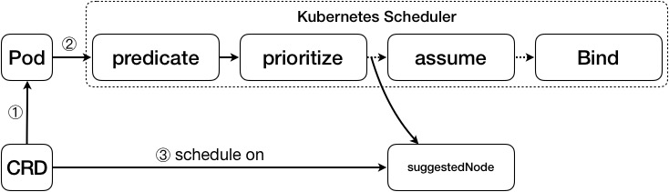

# CRD Scheduler
参考链接：[CRD Scheduler - wsszh](https://github.com/wsszh/k8s-nckubelet/blob/master/doc/crd-scheduler.md)

Kubernetes Scheduler 会通过 kube-apiserver 来获得新创建的 Pod，并通过一定的调度策略选出一个节点，将 Pod 放到这个节点上运行。调度的主要流程分为 predicate, prioritize, assume, bind。

自定义资源（CRD）是对 Kubernetes API 的扩展，每种资源都是存储特定类型 API 对象的集合。

由于 Pod 才是 Kubernetes Scheduler 默认的调度单元，我们想要对 CRD 进行调度，必须先将 CRD “转换”成一个 Pod。这个 Pod 需要做上标记，经由 Kubernetes Scheduler 调度，在调度过程中，只获得最适合这个 Pod 调度的节点的名称，不进行实际的调度过程，最后将 CRD 放置到这个节点上去运行。整体流程如下：


### 自定义资源类型
我们首先通过 CustomResourceDefinition（CRD） 来实现两种新的资源类型，名称分别为 MyApp 和 NCApp，NCApp 对应的 myapp-crd.yaml 文件如下，MyApp 对应的 YAML 文件与之类似。
```yaml
apiVersion: apiextensions.k8s.io/v1beta1
kind: CustomResourceDefinition
metadata:
  name: ncapps.app.example.com
spec:
  group: app.example.com
  names:
    kind: NCApp
    listKind: NCAppList
    plural: ncapps
    singular: ncapp
  scope: Namespaced
  version: v1alpha1
```

接下来，我们创建一个名为 custom-schedule-kind 的 ConfigMap 用来存储需要调度的 CRD 的名字，对应的 crd-configmap.yaml 文件如下所示：
```yaml
apiVersion: v1
kind: ConfigMap
metadata:
  namespace: default
  name: custom-schedule-kind
data:
  kind.1: myapps
  kind.2: ncapps
```
ConfigMap 的 data 中保存了需要监听并调度的 CRD 资源类型的名字，在这里我们使用了名字的复数形式，更加便于实现。

这时，我们就可以创建一个类型为 NCApp 的对象，对象名称为 test-ncapp1，对应的 test-npapp1.yaml 文件如下：
```
apiVersion: app.example.com/v1alpha1
kind: NCApp
metadata:
  name: test-ncapp1
spec:
  # Add fields here
  shell: ""
  cpu: "1"
  mem: "250Mi"
```


NCApp 创建成功之后，我们使用 kubectl describe ncapp test-npapp1 命令来查看 test-npapp1 的状态。

```
Name:         test-ncapp1
...
Spec:
  ...
  Node Name:  iz2ze86eplnjdkjfil6oahz
  ...
```
可以看到 Spec.nodeName 字段已经变为 iz2ze86eplnjdkjfil6oahz，即调度节点的名字。然后就可以将 test-npapp1 放置到这个节点上面运行。

### CRD Scheduler 实现
#### 获取 CRD 资源类型的对象
创建一个新的 CRD 时，kube-apiserver 会创建一个新的 RESTful 路径进行应答。假设现在我们已经创建了 NCApp CRD，并通过 kubectl create -f test-ncapp1.yaml 创建了一个该资源类型的对象。这样我们就可以通过这个新的 RESTful 路径获取 NCApp 的信息。
```sh
$ curl http://39.107.241.0/apis/app.example.com/v1alpha1/namespaces/default/ncapps

{"apiVersion":"app.example.com/v1alpha1","items":[{"apiVersion":"app.example.com/v1alpha1","kind":"NCApp","metadata":{"annotations":{"kubectl.kubernetes.io/last-applied-configuration":"{\"apiVersion\":\"app.example.com/v1alpha1\",\"kind\":\"NCApp\",\"metadata\":{\"annotations\":{},\"name\":\"test-ncapp1\",\"namespace\":\"default\"},\"spec\":{\"fileURL\":\"https://github.com/operator-framework/operator-sdk/blob/master/release.sh\",\"input\":\"Hello World!\"}}\n"},"creationTimestamp":"2019-01-06T08:13:01Z","generation":1,"name":"test-ncapp1","namespace":"default","resourceVersion":"5501056","selfLink":"/apis/app.example.com/v1alpha1/namespaces/default/ncapps/test-ncapp1","uid":"e2bfa43b-118a-11e9-9575-00163e0ad522"},"spec":{"fileURL":"https://github.com/operator-framework/operator-sdk/blob/master/release.sh","input":"Hello World!","nodeName":"iz2ze86eplnjdkjfil6oahz"}}],"kind":"NCAppList","metadata":{"continue":"","resourceVersion":"5577437","selfLink":"/apis/app.example.com/v1alpha1/namespaces/default/ncapps"}}
```


#### CRD 资源类型对象的更新

Pod 可以通过向 binding 对应的 API （`http://$SERVER/api/v1/namespaces/default/pods/$PODNAME/binding/`）发送 POST 请求来将 Pod 与 Node 绑定。

但是 CRD 却没有 binding 对应的 API，需要向 CRD 对象对应的 API 发送 PATCH 请求来实现更新。需要将请求 Header 的 Content-Type 字段设置为 application/merge-patch+json，并在请求 Body 中包含需要更新的字段信息。

发送 PATCH 请求之前，先执行 kubectl describe ncapp test-ncapp1 查看 test-ncapp1 对象的信息：

```
Name:         test-ncapp1
...
Spec:
  File URL:   https://github.com/operator-framework/operator-sdk/blob/master/release.sh
  Input:      Hello World!
...
```
在发送完 PATCH 请求，并得到正确的响应信息后，再次执行 kubectl describe ncapp test-ncapp1。

```
Name:         test-ncapp1
...
Spec:
  File URL:   https://github.com/operator-framework/operator-sdk/blob/master/release.sh
  Input:      Hello World!
  Node Name:  node1
...
```
可以看到 Spec 中增加了一个Node Name 字段，这个 nodeName 就是 test-ncapp1 应该调度到的节点的名字。

#### 整体实现逻辑
1. 读取名为 extra-schedule-kind 的 ConfigMap，获得需要监听的 CRD 资源类型的名字
2. 对于监听的每一种 CRD 资源类型，通过向 kube-apiserver 发送请求定期获取该资源类型的最新的对象清单，从中筛选出还没有指定 NodeName 的对象。
3. 对于 2 中没有指定的 NodeName 的对象，创建一个同名的 Pod ，并在 Pod 的 Label 中添加"crd-name: <crd-name>"。
4. 修改 kubernetes 对 Pod 的调度逻辑，如果一个 Pod 具有 "crd-name" 这个 Label，就只获取该 Pod 需要调度到的节点的名称，并不进行实际的调度操作。
5. 向 4 中的 Pod 同名的 CRD 对象对应的 API 发送 PATCH 请求，更新该对象 Spec.nodeName 字段。